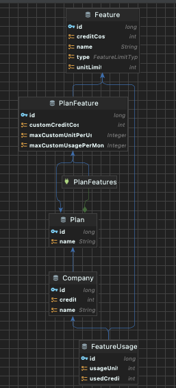

## 팀리부뜨 과제

### 주요 기술 버전
* Kotlin 1.9.25
* SpringBoot 3.4.4

### 사용 기술
- 기술스택 : JPA, Mysql,
- 테스트 : junit5, RestAssured-Kotlin-Extension, Kotest, Mockk
- API 명세 도구 : Swagger
- 인프라 : docker-compose 

### 주요 도메인 구조


### application 구동 방법
```
docker-compose up --build
```

### API 명세
* docker-compose로 빌드 후 app이 실행되면 아래 URL 참조
* http://localhost:8080/swagger-ui/index.html#/
